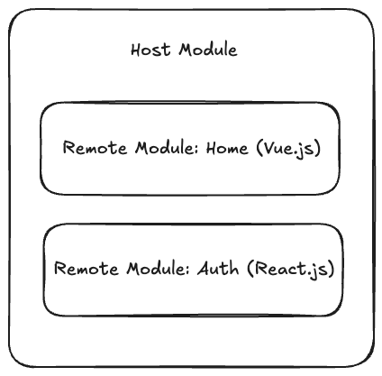

# Run-time Microfrontend
Microfrontend project using run-time integration.

Tools:
- PNPM
- Webpack 5
- React.js
- Vue.js

## Architecture

## Run project
- Install dependencies in all modules using `pnpm init`
- Compile remote modules (Auth and Home) using the command `pnpm start`
- Compile host module using `pnpm start`
